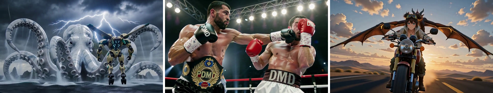

## PDMD: Projected Distribution Matching Distillation for Video Diffusion Models

### [Paper](https://arxiv.org/abs/2609.35768) | [Project Page](https://pdmd2026.github.io/) | [Hugging Face](https://huggingface.co/pdmd2026)



This repo contains four- and two-step PDMD checkpoints for joint video–audio generation (distilled
from MiniMax-H3-33B), and code to run them on a single 24GB or 80GB GPU. You can find more videos, with
sound, on our [project page](https://pdmd2026.github.io/).

> [**PDMD: Projected Distribution Matching Distillation for Video Diffusion Models**](https://arxiv.org/abs/2609.35768)<br>
> Zimo Wang, Junkun Yuan, Angtian Wang, Haotian Yang, Canyu Zhang, Siyuan Yuan, Xingchang Huang,
> Bo Liu, Yizhi Wang, Yiding Yang, Chongyang Ma, Gordon Guocheng Qian
> <br>UC San Diego, ByteDance<br>

Distribution Matching Distillation (DMD) reduces video diffusion models to a few network
evaluations (NFE), but its samples can degrade during training, drifting toward oversaturation and
artifacts. We trace this instability to critic errors that accumulate in successive student
updates, and introduce Projected Distribution Matching Distillation (PDMD), which projects out the
component of the DMD update parallel to the student–critic endpoint residual, an unbiased estimate
of the critic's endpoint error. PDMD is a one-line change to DMD, with no extra loss, network, data,
model pass, or training stage. With Wan2.1, PDMD reaches a VBench total score of 83.73 at 4 NFE;
on MiniMax-H3 joint video–audio generation, it reaches a VideoGen-Eval visual total of 83.17 and
the best score on all six audio metrics among the compared 4-NFE models.

This repository contains:

* 🪐 PDMD checkpoints at 4 NFE (full weights and LoRA) and 2 NFE (LoRA)
* ⚡️ Inference scripts that run them on a single 24GB GPU ([`run_a10.py`](worker/run_a10.py)) or a single 80GB GPU ([`run_a100.py`](worker/run_a100.py))
* 💥 A [tool](worker/fuse_lora.py) that fuses the PDMD LoRAs into the base transformer
* 📊 [Video evaluation](eval/video/README.md): VBench quality and Qwen semantic scoring on 387 VideoGen-Eval prompts
* 🔊 [Audio evaluation](eval/audio/README.md): PQ, CE, CU, IS, IB and DeSync

> **Note.** The main script, `run_a10.py`, is optimized for GPUs with little memory, e.g. an NVIDIA A10
> (24GB of GPU memory, with 128GB of host RAM). The script quantizes the transformer and the Qwen3-VL
> text encoder to int8, and offloads their weights to host memory: the transformer is streamed to the
> GPU one block at a time and the text encoder one layer at a time, and the VAE is moved to the GPU
> only to decode. On 80GB GPUs, `run_a100.py` runs all components in bf16 instead (see
> [Sampling](#sampling)).


## Setup

First, download and set up the repo:

```bash
git clone https://github.com/ZeamoxWang/pdmd.git
cd pdmd
```

Install the dependencies (the versions we tested):

```bash
pip install torch==2.14.0 torchvision==0.29.0 torchaudio==2.11.0
pip install "git+https://github.com/huggingface/diffusers.git@e0abab83b5df05de9e7abd788643c1a7c1e42e28" \
  transformers==5.17.0 accelerate==1.15.0 peft==0.21.0 torchao==0.18.0 \
  safetensors==0.8.0 av==18.1.0 huggingface_hub==1.33.0 pillow numpy
```

The inference script reuses the job parsing and audio/video muxing of
[MiniMax-H3-Turbo](https://github.com/ModelTC/Minimax-H3-Turbo):

```bash
git clone https://github.com/ModelTC/Minimax-H3-Turbo.git
git -C Minimax-H3-Turbo checkout 02e26d591f7a04d5d1a074c9566d5dd4f22f6225
```


## Pre-trained checkpoints

| Model | NFE | Type | Size | Download |
|---|---|---|---|---|
| PDMD | 4 | full transformer | 66 GB | [pdmd2026/pdmd_4NFE_full](https://huggingface.co/pdmd2026/pdmd_4NFE_full) |
| PDMD | 4 | LoRA (rank 128) | 1.4 GB | [pdmd2026/pdmd_4NFE_lora](https://huggingface.co/pdmd2026/pdmd_4NFE_lora) |
| PDMD | 2 | LoRA (rank 128) | 1.4 GB | [pdmd2026/pdmd_2NFE_lora](https://huggingface.co/pdmd2026/pdmd_2NFE_lora) |

All checkpoints are for the base `transformer/` of MiniMax-H3 (the FL2VA/T2VA partition), which
also provides the text encoder, VAEs and schedulers. Download the base model and the checkpoint(s)
you want to run; the checkpoints are independent of each other:

```bash
hf download MiniMaxAI/MiniMax-H3 --exclude "transformer_ref/*" --exclude "FL2VA/*" --exclude "Ref2VA/*"
hf download pdmd2026/pdmd_4NFE_full --local-dir ckpt/pdmd_4NFE_full
hf download pdmd2026/pdmd_4NFE_lora --local-dir ckpt/pdmd_4NFE_lora
hf download pdmd2026/pdmd_2NFE_lora --local-dir ckpt/pdmd_2NFE_lora
```

The 4-NFE full transformer is a drop-in replacement for the base model's transformer:

```python
import torch
from diffusers import MiniMaxH3Transformer3DModel

transformer = MiniMaxH3Transformer3DModel.from_pretrained("pdmd2026/pdmd_4NFE_full", torch_dtype=torch.bfloat16)
```

The LoRAs cover the attention projections and both feed-forward layers of every transformer and
token-refiner block, and are fused into the base transformer once (on CPU, ~15 min):

```bash
python worker/fuse_lora.py --lora ckpt/pdmd_4NFE_lora/lora_model_0.safetensors --output ckpt/pdmd_4NFE_fused
python worker/fuse_lora.py --lora ckpt/pdmd_2NFE_lora/lora_model_0.safetensors --output ckpt/pdmd_2NFE_fused
```


## Sampling

Generate a video with [`worker/run_a10.py`](worker/run_a10.py), passing the PDMD transformer and the
number of steps. For example, with the 4-NFE checkpoint:

```bash
python worker/run_a10.py \
  --transformer-path ckpt/pdmd_4NFE_full --inference-steps 4 \
  --jobs-json jobs/giant_cat_harbor_768p_4nfe.json \
  --turbo-repo Minimax-H3-Turbo --output-dir outputs
```

Use `--transformer-path ckpt/pdmd_4NFE_fused` for the 4-NFE LoRA, or
`--transformer-path ckpt/pdmd_2NFE_fused --inference-steps 2 --jobs-json jobs/giant_cat_harbor_768p_2nfe.json`
for 2 NFE. Videos are written as `outputs/<job>_<index>_<N>nfe_seed<seed>.mp4`.

**Jobs.** A job file lists prompts with their length, resolution and aspect ratio, plus an optional
`inference_steps` (see [`jobs/`](jobs) for examples). The example jobs generate a 14.4-second,
1344×768 clip of a building-sized cat over a harbor, with sound, at seed 42. Sampling uses time shift 12 for video and no
classifier-free guidance (MiniMax-H3 is guidance-distilled).
For 2-NFE generation, we recommend **audio time shift 6**; use **3 for paper metrics**.
Credit to [CALMDUST (@core_tan) on X](https://x.com/core_tan) for the suggestion.

**Many videos.** `run_a10.py` takes ~25–30 min to load the model. To pay that once, pass several
files to `--jobs-json`, or omit it and the script keeps running as a worker that picks up job files
dropped into `--queue-dir`.

**Hardware.** `run_a10.py` is built for GPUs with 24GB of memory and needs **128GB of host RAM**: the
transformer and the Qwen3-VL text encoder are quantized to int8 and streamed from CPU to GPU, and the
VAE is moved to the GPU only to decode. On an NVIDIA A10 at 1344×768 and 345 frames:

| | 4 NFE | 2 NFE |
|---|---|---|
| Denoising | ~25.5 min | ~13 min |
| VAE decoding | ~5 min | ~5 min |
| **Per video** (model loaded) | **~31 min** | **~16–19 min** |
| Peak GPU memory | 21 GiB | 21 GiB |

**80GB GPUs.** On an 80GB GPU such as an A100 80GB, use [`worker/run_a100.py`](worker/run_a100.py),
which takes the same arguments:

```bash
python worker/run_a100.py \
  --transformer-path ckpt/pdmd_4NFE_full --inference-steps 4 \
  --jobs-json jobs/giant_cat_harbor_768p_4nfe.json \
  --turbo-repo Minimax-H3-Turbo --output-dir outputs
```

`run_a100.py` runs all components in bf16, without quantization, so its videos are not identical to
those of `run_a10.py`. It moves each component to the GPU as a whole when the component runs, except
the transformer, which is still streamed one block at a time because its bf16 weights plus the
activations of a long 768p clip do not fit in 80GB (`--transformer-offload none` keeps the whole
transformer on the GPU, for shorter or lower-resolution clips). It also needs 128GB of host RAM. On
an A100 80GB at 1344×768 and 345 frames, a 4-NFE video takes ~10 min (~7.7 min denoising), with a
peak GPU memory of 62.5 GiB.


## 2-NFE samples

The 2-NFE LoRA still shows some painterly, oil-painting-like texture, oversaturation and degraded
audio, but as of the end of September 2026 it is, to our knowledge, the only publicly released 2-NFE
distilled LoRA for MiniMax-H3. In some scenes its samples are on par with those of the 4-NFE
checkpoint, though overall a gap to 4 NFE remains. Below are four prompts, each sampled at 2 NFE and
at 4 NFE (with sound); more videos are on the [project page](https://pdmd2026.github.io/).

### The viaduct

<details>
<summary>Prompt</summary>

[Shot 1] Live-action, cinematic, a medium-wide view from a mountain station terrace frames a slender elevated viaduct between green summits in bright morning light. The rounded nose of a streamlined ivory train with a teal window band enters from the left and moves smoothly past the camera, white platform columns reflected in its dark windows with a few seated passengers as quiet silhouettes. The camera pans right at slow speed to follow the first carriage, revealing the track extending out over a cloud-filled valley with the departure already underway. [Shot 2] At 00:04.000, the camera cuts to a wide lateral aerial view of the complete six-carriage train crossing the viaduct. The camera tracks at matching speed while regularly spaced white supports pass beneath and the valley clouds stay far below the track; a green summit with a small glass station appears ahead as the train follows a gentle curve, its carriages physically connected and its wheels aligned to the rail. [Shot 3] At 00:09.000, the shot cuts to an elevated view from beyond the destination summit as the train rounds the final curve toward the glass station. The camera pulls out with large amplitude at slow speed to reveal the viaduct connecting several mountain peaks, sunlight on the ivory carriages and station roof, soft blue shadows beneath the bridge, and the original departure terrace faintly visible in the distance, ending with the train still moving and open blue sky above. overall_soundscape: Steel wheels run over rail joints in an even rhythmic pattern beneath a smooth electric traction hum. Air rushes along the carriage sides and changes tone as the train passes the camera, and a high mountain wind crosses the viaduct supports between passes. non_diegetic_music: A repeating piano figure at a moderate tempo with sustained strings and a light rhythmic pulse, broadening in volume through the final wide view.

</details>

**2 NFE**

https://github.com/user-attachments/assets/d1f3a96b-bd9f-4f76-a8d7-fe5f733ff606

**4 NFE**

https://github.com/user-attachments/assets/f793e523-5f6c-40e5-a6e9-00b86e8b952b

### The red footbridge

<details>
<summary>Prompt</summary>

[Shot 1] 3D CG, cinematic fantasy, a medium-wide view beside a small red footbridge over a clear stream frames a hiker in a cream jacket and blue backpack pausing on the bridge as a broad shadow moves gently across the water. The camera tilts up with medium amplitude at slow speed through a clean gap in enormous trees, revealing part of the pale stone shoulder and head of a mountain-sized titan covered in living moss beyond the canopy. Leaves move lightly in the breeze while the forest stays still enough for the enormous figure to read clearly as it looks toward the open meadow. [Shot 2] At 00:04.000, the camera cuts to a wide side view at the forest edge as the titan takes one slow step out from between two huge trees and places its foot on an open stone terrace without crushing vegetation. Moss on its shoulders shifts subtly and long grass tufts bend in the displaced air while the camera trucks right at slow speed, keeping the entire body visible against blue sky with the red footbridge tiny in the lower background. [Shot 3] At 00:09.000, the shot cuts to a high wide view across the bright alpine meadow as the titan settles into a still relaxed stance beside a mountain ridge, its pale stone body echoing the geology around it. The camera pulls out with large amplitude at slow speed to reveal stream, forest, bridge, and hiker as one coherent valley; the titan raises its head slightly toward the sunlight and then stays calm, the frame ending with the broad figure offset against open sky. overall_soundscape: A clear stream runs under the footbridge while wind moves through enormous leaves overhead. The titan's step lands as a deep low ground impact with grinding stone and a soft shift of moss and loose earth, followed by a broad displacement of air across the grass and returning birdsong. non_diegetic_music: Sustained low strings at a slow tempo with a simple woodwind line, joined by soft choral tones as the titan steps out and settling into a held chord.

</details>

**2 NFE**

https://github.com/user-attachments/assets/84ed6a07-7921-4154-b668-fde7d86df970

**4 NFE**

https://github.com/user-attachments/assets/8ee0f350-c0bf-4f61-b43a-3123fff7e4d3

### Lantern-head

<details>
<summary>Prompt</summary>

[Shot 1] Live-action, cinematic, a low medium-wide shot frames a steampunk mechanical creature walking forward through ancient fog-filled ruins, its head replaced by a large brass lantern with flames flickering inside the glass. Brass gears turn and pistons flex at the hips and shoulders as it moves with real weight, and the shifting firelight travels across its metal body and the broken stone around it. The camera tracks backward at matching speed ahead of the creature while occasional embers float through the misty air. [Shot 2] At 00:05.000, the camera cuts to a closer side view of the torso and lantern head as the creature stops and scans its surroundings with slow deliberate head motions. Internal flames rise and fall, throwing moving light onto fluted columns and fallen masonry, while exposed pistons vent thin steam and the camera trucks right at slow speed to reveal the depth of the ruined hall behind it. [Shot 3] At 00:10.000, the shot cuts to a wide view down a collapsed colonnade as the creature resumes walking away from the camera, its lantern head the brightest point in the fog. The camera pulls out with medium amplitude at slow speed, revealing the scale of the ruins while background fog rolls slowly in the wind and faint cinders drift past the lens, ending with the figure small between the broken columns. overall_soundscape: Heavy metal feet strike stone with deep echoing impacts, and brass gears click and ratchet continuously through each step. Pistons release short steam hisses, fire inside the lantern crackles and gusts, and a low wind moves through the ruined hall. non_diegetic_music: A low sustained drone at a slow tempo with sparse metallic percussion, joined by a single repeating low string figure that increases slightly in volume as the creature walks away.

</details>

**2 NFE**

https://github.com/user-attachments/assets/7d2a5546-86e5-451c-b638-061a7e49f3c0

**4 NFE**

https://github.com/user-attachments/assets/b3906199-6f02-4232-b995-003da2e01b6f

### The thorned rider

<details>
<summary>Prompt</summary>

[Shot 1] 3D CG, dark high-fantasy cinematic style in one continuous shot, a hooded horned rider in dark spiked armor with a tattered black cloak and a thorned crown-like halo above his hood sits mounted on a massive black demonic horse with large curved horns, a tar-slicked coat, and chain-laced tack, both standing in near-static frontal pose on wet scorched ground in a misty forest of dead trees under a red-lit sky. A searing corona of red-white flame burns from the rider's back and reflects across the flooded ground. The camera holds a near-static shot with a very slow push in as the rider (S1) raises his outstretched arm further, fingers flexing into a commanding gesture, his hooded head tilting slightly, and says in a low, gravelly, echoing voice: &lt;d&gt;[English] Where in the world is Mordor?&lt;/d&gt; His cloak catches the wind and billows outward, snapping along its ragged edges, while the flame corona intensifies and writhes larger with volatile twisting motion. Behind them the bare dead trees sway and creak, branches shifting against the glowing red haze. The horse shifts its weight and stomps one foreleg into the wet ground, sending up a small splash and a scatter of embers that ripple the reflected firelight beneath them. Fine embers drift past the lens throughout, blurring softly as they pass while rider and horse stay sharp, and the shot ends with the rider still mid-gesture, arm extended, cloak settling, and the corona still restlessly burning. overall_soundscape: Wind drives steadily through dead branches that creak and knock against one another. The flame corona roars and gutters with each surge, embers tick faintly as they pass the lens, and a heavy hoof stamps into shallow standing water with a wet splash followed by chain tack rattling and low equine breathing. non_diegetic_music: A low sustained drone at a slow tempo under sparse percussive strikes, with a single deep brass tone entering beneath the gesture and holding as the flame surges.

</details>

**2 NFE**

https://github.com/user-attachments/assets/146614de-d108-45f5-ad6e-5c72cb5b1561

**4 NFE**

https://github.com/user-attachments/assets/a93db73e-84ae-4708-8e0d-c0991ff192de


## BibTeX

```bibtex
@misc{wang2026pdmdprojecteddistributionmatching,
      title={PDMD: Projected Distribution Matching Distillation for Video Diffusion Models},
      author={Zimo Wang and Junkun Yuan and Angtian Wang and Haotian Yang and Canyu Zhang and Siyuan Yuan and Xingchang Huang and Bo Liu and Yizhi Wang and Yiding Yang and Chongyang Ma and Gordon Guocheng Qian},
      year={2026},
      eprint={2609.35768},
      archivePrefix={arXiv},
      primaryClass={cs.CV},
      url={https://arxiv.org/abs/2609.35768},
}
```


## Acknowledgments

We thank the authors of [MiniMax-H3](https://huggingface.co/MiniMaxAI/MiniMax-H3) and
[Diffusers](https://github.com/huggingface/diffusers).
